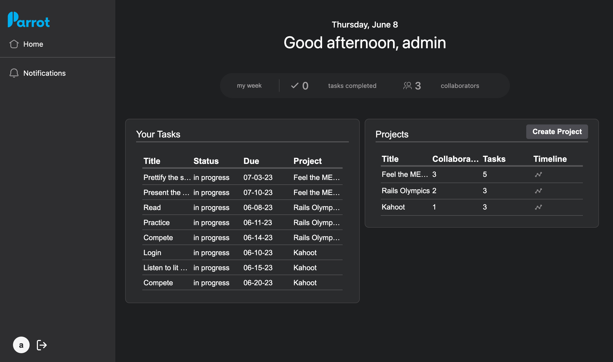
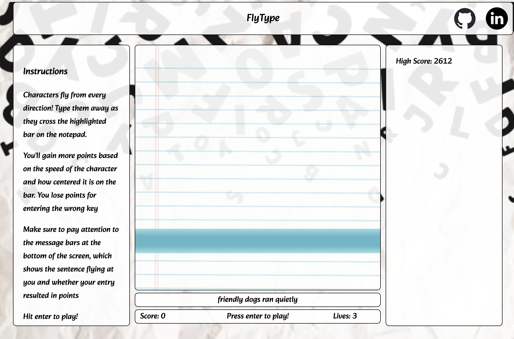

<a style="font-size: 88px;" href="https://www.linkedin.com/in/mibird/" target="_blank"> 
    Connect on LinkedIn
    </a>
 

 
 ##  Michael Bird here! 🦅
 Software engineer 💻, creative problem solver 🧩, builder 👷🏼‍♂️, and (most importantly) team cheerleader 📣
 
### 🔎 A Bit of Background
I love working with other impassioned individuals to break down big problems into their most granular components, solving them one by one until we’ve built something amazing. Stepping back to take stock of the cumulative impact of a team’s regular, thoughtful efforts never fails to put a smile on my face 😃

I’ve been lucky to have many of these experiences over the last 10+ years at Apple, Stripe, and Uber in Partnerships and Product roles leading cross functional teams to design, launch, and scale new products. Working with so many stakeholders over the course of my career has provided me with a multi-disciplinary perspective in product development and the ability to preemptively identify and bypass potential pitfalls as we build them to fruition.

### 👨🏻‍🎨 Some of My Projects
Make sure to check back on them for even MORE features...I have a hard time putting them down 😅
<table>
  <tr>
    <td>
         
      </td>
    <td>
        <a href="https://b-there.herokuapp.com/" target="_blank">bThere</a> 
        Create events, send customized invitation forms, and track responses with bThere, an RSVPify inspired full stack event management suite powered by Rails, React/Redux, PostgreSQL, AWS, HTML5, and CSS3.</td>
  </tr>
    
  <tr>
    <td>
         
      </td>
    <td>
        <a href="https://www.parrotpm.com/" target="_blank">ParrotPM</a> 
        Ideate, develop, and execute complex projects with ParrotPM, a project management suite harnessing the power of AI generated project plans, interactive data visualizations, and automated reporting. Powered by MongoDB, Express, React / Redux, Node, Mongoose, and Open AI / ChatGPT.and CSS3.</td>
  </tr>
    
  <tr>
    <td>
         
      </td>
    <td>
        <a href="https://apporator.github.io/fly-type/" target="_blank">FlyType</a> 
       Demonstrate your typing speed AND rhythm in FlyType, a typing game and Dance Dance Revolution mix, powered by Javascript, Webpack, Canvas, HTML5, CSS3, and numerous Web APIs.</td>
  </tr>

</table>

### 🧱 My Building Blocks

 
    &nbsp;&nbsp;&nbsp;&nbsp;&nbsp;&nbsp;&nbsp;
    &nbsp;&nbsp;&nbsp;&nbsp;&nbsp;&nbsp;&nbsp;
    &nbsp;&nbsp;&nbsp;&nbsp;&nbsp;&nbsp;&nbsp;
    &nbsp;&nbsp;&nbsp;&nbsp;&nbsp;&nbsp;&nbsp;
    &nbsp;&nbsp;&nbsp;&nbsp;&nbsp;&nbsp;&nbsp;
    &nbsp;&nbsp;&nbsp;&nbsp;&nbsp;&nbsp;&nbsp;
    &nbsp;&nbsp;&nbsp;&nbsp;&nbsp;&nbsp;&nbsp;
    &nbsp;&nbsp;&nbsp;&nbsp;&nbsp;&nbsp;&nbsp;
    &nbsp;&nbsp;&nbsp;&nbsp;&nbsp;&nbsp;&nbsp;
    &nbsp;&nbsp;&nbsp;&nbsp;&nbsp;&nbsp;&nbsp;
          
    &nbsp;&nbsp;&nbsp;&nbsp;&nbsp;&nbsp;&nbsp;
    &nbsp;&nbsp;&nbsp;&nbsp;&nbsp;&nbsp;&nbsp;
    &nbsp;&nbsp;&nbsp;&nbsp;&nbsp;&nbsp;&nbsp;
    &nbsp;&nbsp;&nbsp;&nbsp;&nbsp;&nbsp;&nbsp;
    &nbsp;&nbsp;&nbsp;&nbsp;&nbsp;&nbsp;&nbsp;
    &nbsp;&nbsp;&nbsp;&nbsp;&nbsp;&nbsp;&nbsp;
    &nbsp;&nbsp;&nbsp;&nbsp;&nbsp;&nbsp;&nbsp;
    &nbsp;&nbsp;&nbsp;&nbsp;&nbsp;&nbsp;&nbsp;
    &nbsp;&nbsp;&nbsp;&nbsp;&nbsp;&nbsp;&nbsp;
    &nbsp;&nbsp;&nbsp;&nbsp;&nbsp;&nbsp;&nbsp;

